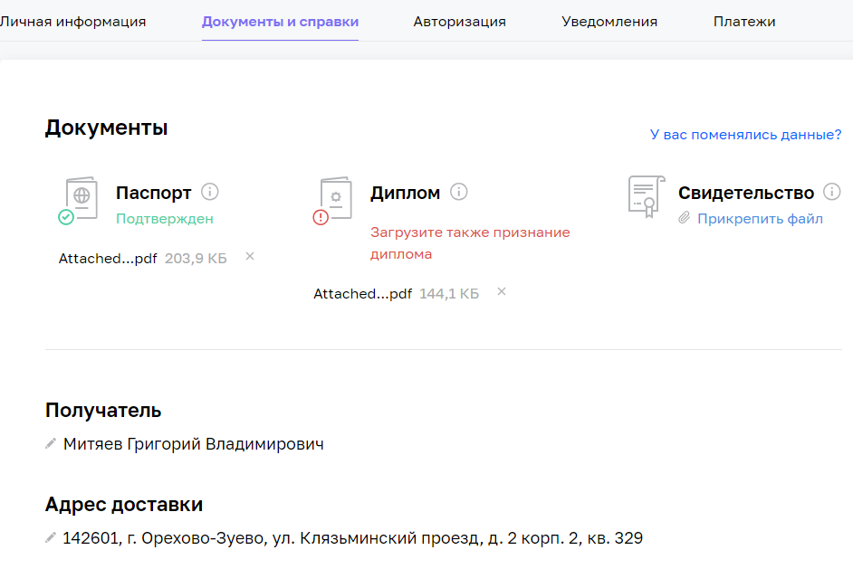
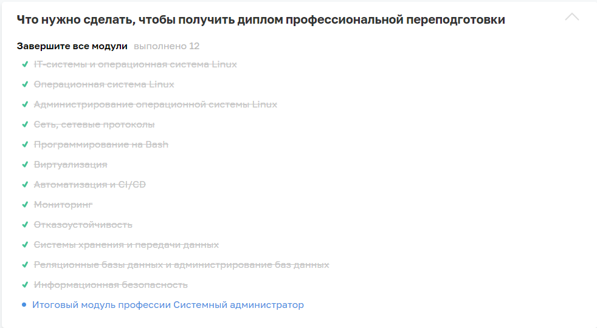

# diploma_prerequisites_fsys-19

## Задание для допуска к дипломной работе

### 1. Получилось ли у вас загрузить в личный кабинет документы, подтверждающие личность, и диплом о высшем или среднем специальном образовании?

<pre>
а) Да
   Пришлите ссылку на скриншот личного кабинета.
б) Нет, но сделаю это в ближайшее время. Инструкция по загрузке документов в личный кабинет.  
в) Не загрузил диплом, у меня его нет
</pre>

**Ответ:**
<pre>
a) Да (но подтверждение своего ирландского диплома пока делать не планирую)
</pre>
<kbd></kbd>

### 2. Нужна ли вам справка об обучении после сдачи дипломной работы? Справка выдаётся всем студентам, в том числе тем, у кого нет диплома о высшем или среднем специальном образовании.

а) Да
После получения зачёта по дипломной работе напишите в чат поддержки.
б) Нет

**Ответ:**
<pre>
а) Да
</pre>

### 3. Выполнен ли вами необходимый минимум заданий на каждом модуле профессии для допуска к дипломной работе?

а) Да
Поздравляем! Сообщим вам позже, кто будет вашим дипломным руководителем.
б) Нет
В этом случае у вас нет допуска к дипломной работе. Если вы хотите сдать домашние работы на закрытых модулях, свяжитесь с координатором вашей профессии.

**Ответ:**
<pre>
а) Да
</pre>

<kbd></kbd>
